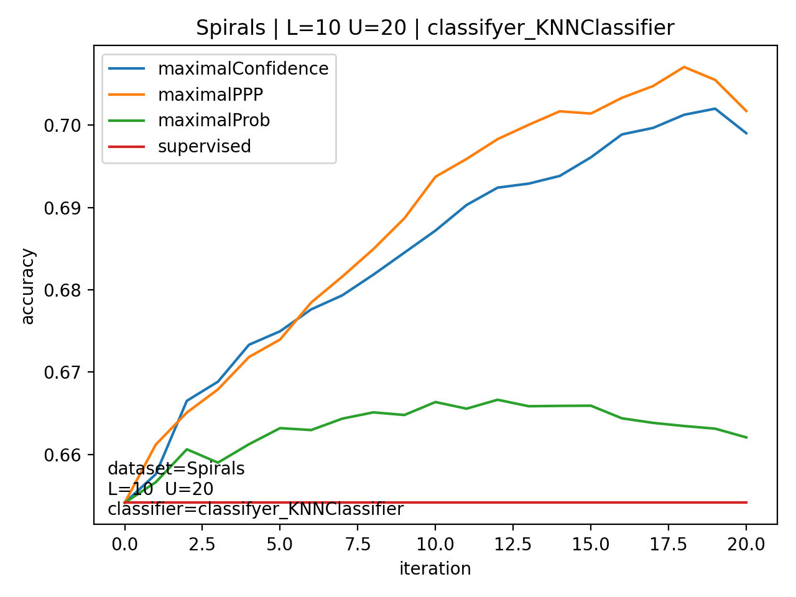
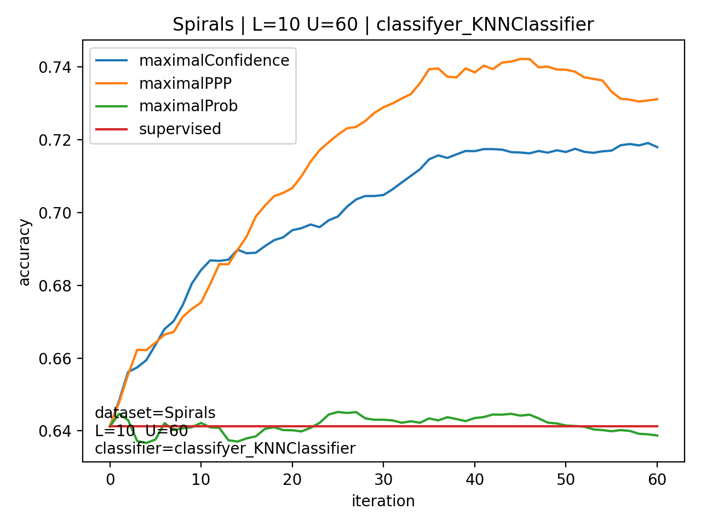
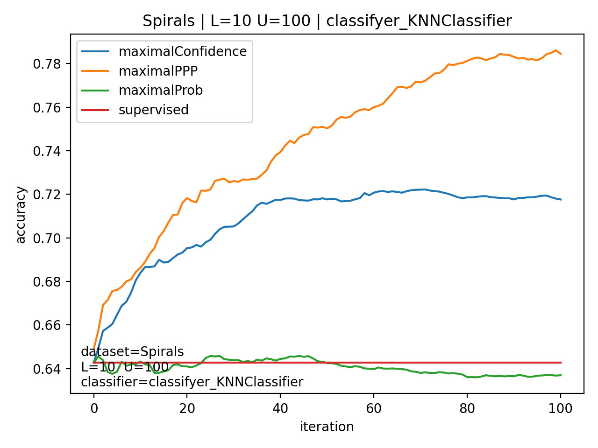
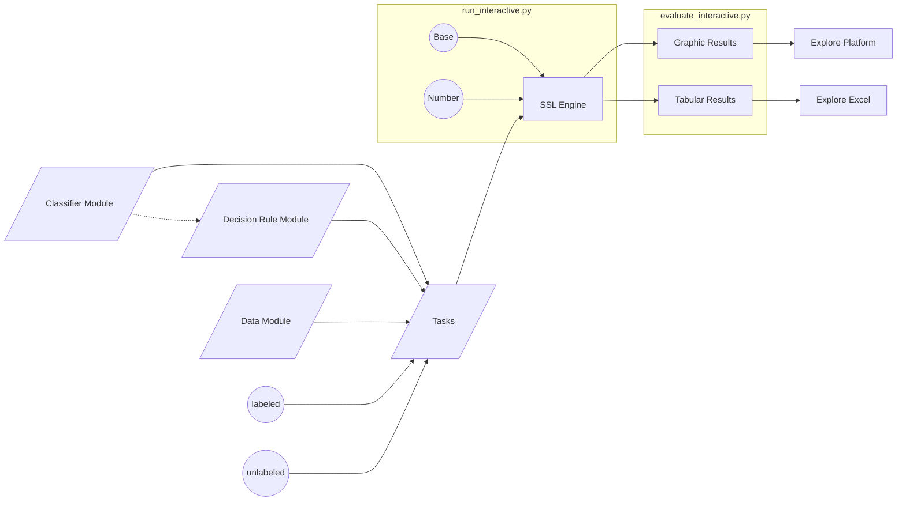

[](https://app.codecov.io/github/stefan-maximilian-dietrich/tabpfn_ssl)
# Bayesian Pseudo-Label Selection with Prior-Data Fitted Networks

**Research Repository**

This project was developed as part of the course **Applied Deep Learning**  
and supervised by **Prof. Dr. David Rügamer**.

Author: **Stefan Maximilian Dietrich**  
Date: **February 2026**

---
# Table of Contents

- [Theoretical Background](#theoretical-background)
  - [Bayesian Pseudo-Label Selection in SSL](#1-bayesian-pseudo-label-selection-in-ssl)
  - [Prior-Data Fitted Networks and TabPFN](#2-prior-data-fitted-networks-and-tabpfn)
  - [SSL with PFNs: Decision-Theoretic Selection](#3-ssl-with-pfns-decision-theoretic-selection-via-posterior-predictives)

- [Results](#results)
  - [Experimental Configurations](#experimental-configurations)
  - [Observations](#observations)

- [Installation](#installation)

- [How to Use](#how-to-use)
  - [Local Execution](#local-execution-default)
  - [Cluster Execution (LRZ AI Systems via SLURM)](#cluster-execution-lrz-ai-systems-via-slurm)
  - [Evaluation Mode](#evaluation-mode)

- [Documentation (Modular Architecture & Extensibility)](#dokumentation-modular-architecture--extensibility)
  - [Datasets](#datasets-basedataset--concrete-dataset-classes)
  - [Classifiers](#classifiers-unified-wrapper-interface)
  - [Decision Rules](#decision-rules-pseudo-label-selection-logic)
  - [Tasks](#tasks-experiment-definitions)

- [Citation and License](#citation-and-licennce)
---
# Theoretical Background

This repository builds on a decision-theoretic perspective on semi-supervised learning (SSL), combining Bayesian pseudo-label selection with Prior-Data Fitted Networks (PFNs), in particular TabPFN.

---

## 1) Bayesian Pseudo-Label Selection in SSL

Obtaining labeled data is often costly, time-consuming, and dependent on expert knowledge, whereas unlabeled data are typically abundant and easy to collect. This imbalance has led to the rise of semi-supervised learning (SSL), with self-training (or pseudo-labeling) being one of the most widely used approaches [McClosky et al., 2006](https://aclanthology.org/N06-1020/) [Lee, 2013](https://www.researchgate.net/publication/280581078) [Shi et al., 2018](https://www.researchgate.net/publication/328123705). Self-training iteratively adds pseudo-labeled instances to the training set based on predictions from a model trained on labeled data. A crucial step in this process is pseudo-label selection (PLS), which determines which pseudo-labeled instances to include.\footnote{Importantly, PLS refers to the selection of pseudo-labeled instances, not the pseudo-labels themselves.}

To mitigate overfitting and the reinforcement of incorrect pseudo-labels (i.e., confirmation bias), selection strategies should be less dependent on the current model and more informed by the structure and uncertainty inherent in the labeled dataset. In [Rodemann et al., 2023A](https://arxiv.org/abs/2302.08883), a Bayesian framework designed to reduce model dependency and improve robustness in the pseudo-label selection process was proposed. This framework has since shown promising results and extensions in [Rodemann et al., 2023B](https://arxiv.org/abs/2303.01117) and [Dietrich et al., 2024](https://arxiv.org/abs/2405.15294).

This framework incorporates a principled approach for pseudo-label selection that explicitly accounts for model uncertainty: the Pseudo Posterior Predictive (PPP). This method provides a robust alternative to conventional selection strategies that rely solely on a single model’s predictions, which are often overconfident, especially in low-data or high-dimensional settings.

The key idea is to avoid evaluating the likelihood of a pseudo-labeled instance $(x_i, \hat{y}_i)$ under a single estimated parameter vector $\hat{\theta}$, which can be prone to overfitting. Instead, the PPP criterion marginalizes over the entire posterior distribution of the model parameters $\theta$, thereby reflecting uncertainty about the correct parameterization. It is formally defined as:

$$ p(D \cup (x_i, \hat{y}_i) \mid D) = \int_{\Theta} p(D \cup (x_i, \hat{y}_i) \mid \theta) \, p(\theta \mid D) \, d\theta $$

where $D$ is the labeled dataset, and $p(\theta \mid D)$ is the posterior over parameters given the observed data. Intuitively, the PPP evaluates how well a candidate pseudo-labeled instance fits not just a single model but a distribution over plausible models.

This approach is both empirically motivated and theoretically grounded in Bayesian decision theory. [Rodemann et al., 2023A](https://arxiv.org/abs/2302.08883) show that selecting the pseudo-labeled instance which maximizes the PPP corresponds to choosing the Bayes-optimal action under a utility function reflecting model fit. By doing so, the method naturally guards against early-stage confirmation bias and prioritizes examples that are consistently probable across the model’s posterior landscape.

In[Rodemann et al., 2023A](https://arxiv.org/abs/2302.08883) and [Dietrich et al., 2024](https://arxiv.org/abs/2405.15294), it has been demonstrated that the integral in question can be feasibly approximated or, in certain simplified cases, computed directly. However, these methods have proven effective primarily for relatively simple model structures and datasets of very small to moderate size. They do not scale to more complex deep learning architectures, particularly when the parameter space $\theta$ resides in a high-dimensional domain, making the integral intractable both analytically and numerically. This is why we turn to the fruitful field of PFNs.

---

## 2) Prior-Data Fitted Networks and TabPFN

Prior-Data Fitted Networks (PFNs), as described in [Müller et al., 2022](https://arxiv.org/abs/2112.10510), are neural networks that directly approximate Bayesian inference by simulating the posterior predictive distribution (PPD) of a given prior. Formally, the PPD integrates over all possible hypotheses $\varphi \in \Phi$ of the data-generating process:

$$ p(y \mid x, D) \propto \int_{\Phi} p(y \mid x, \varphi)\, p(D \mid \varphi)\, p(\varphi)\, d\varphi $$

Instead of performing this integration explicitly using MCMC or variational methods, a Transformer $q_\theta(y \mid x, D)$ is trained to approximate this distribution directly. For that purpose, datasets $D \sim p(D)$ are synthetically generated from a known prior sampler, and the PFN loss is minimized:

$$ \mathcal{L}_{\mathrm{PFN}} = \mathbb{E}_{\{(x_{\text{test}}, y_{\text{test}})\} \cup D_{\text{train}} \sim p(D)} \left[-\log q_\theta(y_{\text{test}} \mid x_{\text{test}}, D_{\text{train}})\right] $$

The resulting network thus learns to approximate the conditional probability distribution $p(y \mid x, D)$ for any new task in a single forward pass, without requiring explicit parameter adaptation during inference. As a result, PFNs replace learning on new data with a form of trained in-context learning behavior grounded in the pre-learned prior.

Building upon the PFN principle, TabPFN [Hollmann et al., 2023](https://arxiv.org/abs/2207.01848) is a transformer model pre-trained to approximate Bayesian inference for small tabular classification problems. Instead of training a new model for each dataset, TabPFN performs in-context learning: given a set of labeled examples and test samples as input, it predicts labels for the test samples in a single forward pass, without any gradient-based updates or hyperparameter tuning.

TabPFN is trained offline once on a large number of synthetic datasets sampled from a prior that combines Bayesian neural networks (BNNs) and structural causal models (SCMs). This prior encodes a preference for simple and causal data-generating mechanisms, reflecting Occam's razor. Through this training, the transformer learns to approximate the posterior predictive distribution implied by that prior, effectively performing Bayesian inference over a large ensemble of possible generative models.

In practice, TabPFN can handle datasets with up to approximately $1{,}000$ training samples, $100$ numerical features, and $10$ classes, producing predictions in less than a second.Which is a huge improvement over the technique described in Section (see Section [Bayesian Pseudo-Label Selection](#bayesian-pseudo-label-selection)). Despite its simplicity and speed, it achieves state-of-the-art accuracy on small numerical datasets, outperforming gradient-boosted decision trees and matching sophisticated AutoML systems while being orders of magnitude faster.

This motivates the use of TabPFN to compute the posterior predictive distribution (PPD), which we employ to approximate the PPP in this paper.

---

## 3) SSL with PFNs: Decision-Theoretic Selection via Posterior Predictives
As stated in the second theorem in [Rodemann et al., 2023A](https://arxiv.org/abs/2302.08883), for our purposes it holds that:

$$ p(D \cup (x_i, \hat{y}_i) \mid D) = p(\hat{y}_i \mid x_i, D) $$

This implies that the selection based on the TabPFN-calculated PPD approximation for a fixed predicted label corresponds to the Bayes-optimal action. Hence, the method is grounded on a solid decision-theoretic foundation. An additional advantage is that the approach is model-agnostic and removes the need to explicitly define a prior distribution.

The computational efficiency demonstrated in [Hollmann et al., 2023](https://arxiv.org/abs/2207.01848) further improves scalability, allowing larger datasets and higher-capacity models to be handled effectively. A promising extension would involve defining a multi-objective utility function over multiple PFNs, analogous to a multi-model likelihood approach.

# Results

This chapter presents first empirical results of the method proposed above.  
The approach uses the **Pseudo Posterior Predictive (PPP)** as decision criterion witch are computed using **TabPFN**.  

In the plots, this method is referred to as **`maximalPPP`** and is displayed in **orange**.

As a reference baseline, standard supervised learning without the addition of pseudo-labels is included. This baseline is denoted as **`supervised`**, shown in **red**, and represents regular supervised training using only the labeled data.

In addition, two ad-hoc decision criteria are included for comparison:

### 1) `maximalProb`

This strategy selects the pseudo-labeled instance whose *predicted class probability* (for the predicted class) is maximal.  
Formally, after fitting the classifier on the labeled data, all pseudo instances are evaluated and the instance with the highest predicted probability is selected.

This corresponds to a purely probability-driven heuristic without explicitly considering uncertainty around the decision boundary.

### 2) `maximalConfidence`

The `maximalConfidence` rule selects the pseudo-labeled instance with the **largest distance from the decision boundary**.

Concretely, after fitting the classifier on the labeled data:

- Predicted class probabilities $p = P(y=1 \mid x)$ are computed.
- The absolute confidence relative to the decision boundary at 0.5 is calculated as $min(p, 1 - p)$
  
- The instance with the smallest value of this quantity is selected.

Since values close to 0 indicate probabilities near 0 or 1, this rule prefers instances for which the classifier is most confident in its prediction (i.e., farthest from the 0.5 boundary).

---

Overall, this comparison allows us to evaluate whether the theoretically motivated **PPP-based selection (`maximalPPP`)** provides advantages over simpler heuristic confidence-based strategies.

---

## Configurations

Each experiment consists of:

- a dataset  
- a fixed number of labeled instances  
- a fixed number of unlabeled instances  
- a chosen classifier  

Internally, every experiment is composed of multiple **sub-experiments**, each corresponding to one decision rule (e.g., `maximalPPP`, `maximalProb`, `maximalConfidence`, `supervised`).

To ensure statistical robustness, every sub-experiment is repeated **100 times** using seeds from **0 to 99**.  
This prevents the reported results from being driven by a particularly favorable or unfavorable random initialization or data split.

The results shown in the plots below correspond to the **mean performance across all 100 repetitions**.

---

### Plot Interpretation

- **x-axis:**  
  Number of pseudo-labeled instances that have already been added to the training set.  
  The leftmost point corresponds to **0 pseudo-labels**, i.e., pure supervised learning.

- **y-axis:**  
  Classification **accuracy** on unseen data.

Thus, each curve illustrates how model performance evolves as additional pseudo-labeled instances are iteratively incorporated into the training data under the respective decision rule.

Each plot shows performance trends across training iterations.

## Results
---
<table>
<tr>
<td align="center">

<br>
<b>Spirals — L=10, U=20 (KNN)</b>
</td>

<td align="center">

<br>
<b>Spirals — L=10, U=60 (KNN)</b>
</td>

<td align="center">

<br>
<b>Spirals — L=10, U=100 (KNN)</b>
</td>
</tr>

<tr>
<td align="center">

<br>
<b>Spirals — Variant 4 (KNN)</b>
</td>

<td align="center">

<br>
<b>Spirals — Variant 5 (KNN)</b>
</td>

<td align="center">

<br>
<b>Spirals — Variant 6 (KNN)</b>
</td>
</tr>
</table>

---

### Results: Spiral Dataset (K-Nearest Neighbors)

For the Spiral dataset using a K-Nearest Neighbors classifier, we observe that in every configuration the supervised baseline is consistently outperformed.

In particular, the PPP-based selection strategy (`maximalPPP`) computed with TabPFN achieves the best performance across all settings, outperforming both heuristic alternatives (`maximalProb` and `maximalConfidence`).

Several patterns are noteworthy:

- The performance gap between `maximalPPP` and the other decision rules increases as more unlabeled data becomes available.
- The advantage over the supervised baseline is present in all configurations.
- In contrast to the heuristic methods, the PPP-based approach does not exhibit a clear saturation effect as additional unlabeled data is incorporated.
- Accuracy continues to improve steadily as more pseudo-labeled instances are added.

Overall, these results indicate that the theoretically motivated PPP criterion provides a substantial and increasingly pronounced benefit in this nonlinear classification setting. 

---
# Installation

This repository relies on [uv](https://docs.astral.sh/uv/) for managing the virtual environment and project dependencies.  
Please ensure that `uv` is installed before continuing.

Follow the steps below to set up the project locally:

1. **Create a virtual environment**
   ```bash
   uv venv
   ```

2. **Activate the virtual environment**
   - On Linux/macOS:
     ```bash
     source .venv/bin/activate
     ```
   - On Windows:
     ```bash
     .venv\Scripts\activate
     ```

3. **Install the project in editable mode**
   ```bash
   uv pip install -e .
   ```
> [!IMPORTANT]
> If you have not already done so, you must set a **HuggingFace access token** in order to use the TabPFN method.
>
> TabPFN downloads pretrained model weights from HuggingFace. Without a valid token, model initialization will fail.
>
> A detailed description of how to obtain and configure the token can be found in the official TabPFN repository: https://github.com/PriorLabs/TabPFN
>
> In short, you need to:
>
> 1. Create a HuggingFace account  
> 2. Generate an access token  
> 3. Set it as an environment variable:
>    ```bash
>    export HF_TOKEN="your_token_here"      # Linux/macOS 
>    setx HF_TOKEN "your_token_here"        # Windows
>    ```
# How to Use

The repository supports both local execution and cluster-based execution (LRZ AI Systems).  
From a user perspective, the workflow is identical in both cases — the same script is used and the same interactive interface appears.

> **Important Note on Experiments and Subexperiments**  
> An *experiment* is defined by the configuration:
> - Dataset  
> - Number of labeled samples  
> - Number of unlabeled samples  
> - Classifier  
>
> However, during execution, each experiment is internally split into **subexperiments**, one for each decision method.  
>
> This design is intentional and improves efficiency:
> - Some methods require GPU acceleration.
> - Others can be executed efficiently on CPUs.
>
> By splitting experiments into subexperiments, resource allocation can be optimized automatically.

---

### Local Execution (Default)

To start experiments locally:

```bash
uv run python run_interactive.py
```

This is the default mode when running outside the LRZ AI Systems environment.

---

#### 1) Select a Task Sheet

You will be prompted to choose one of the available task sheets:

```
Which task sheet would you like to run?
-> [1] Task_Spirals.py
   [2] local_smoke.py
   [3] toy_examples.py
Selection (1-3) [default 1]:
```

Enter the corresponding number.  
If no input is provided, the default option is selected.

---

#### 2) Select Experiments

Specify which experiment(s) to execute:

```
Experiment wählen: Zahl (z.B. 3) or Range (z.B. 0-10):
```

Supported formats:

- `3` (single experiment)
- `0-10` (range)
---

#### 3) Configure Seeds

You will then define the seed configuration:

```
NUM_SEEDS [default 5]:
BASE_SEED [default 0]:
```

- `NUM_SEEDS` determines how many times the experiment is repeated.
- Seeds range from:
  
  ```
  BASE_SEED  ...  BASE_SEED + NUM_SEEDS - 1
  ```

Example:

- `BASE_SEED = 0`
- `NUM_SEEDS = 5`

→ Seeds `0, 1, 2, 3, 4`

Experiments (and their subexperiments) are executed sequentially in local mode.

> [!WARNING]
> Reproducing the large-scale experiments presented in the **Results** section requires access to a high-performance GPU.  
> Due to the pseudo-posterior predictive evaluation for each instances in each round, the computational complexity scales approximately quadratically (O(n²)) with the number of unlabeled instances.  
>  
> For a lightweight check of the pipeline, please use `toy_examples.py` witch `NUM_SEEDS < 10`
---

## Cluster Execution (LRZ AI Systems via SLURM)

Access to the LRZ AI Systems is available via SSH:

- Access documentation: https://doku.lrz.de/1-access-10746642.html  
- AI Systems overview: https://doku.lrz.de/ai-systems-11484278.html  
- SLURM documentation: https://doku.lrz.de/5-slurm-1897076524.html  

### Important: The Interface Is Identical

Cluster execution uses the **same script**:

```bash
uv run python run_interactive.py
```

The interaction flow (task selection, experiment selection, seed configuration) is exactly the same.

The only difference lies in the execution backend:

- **Local mode:** subexperiments are executed sequentially.
- **Cluster mode:** each subexperiment is submitted as a separate SLURM job.

Each job is dispatched via SSH to the cluster and scheduled automatically.

---

### What Is SLURM?

SLURM is a workload manager used to distribute computational jobs across compute nodes in a cluster.

It:
- Allocates GPUs, CPUs, memory and runtime
- Queues jobs
- Schedules execution across nodes
- Enables parallel execution

---

### Resource Configuration

Cluster jobs are defined in:

```
train_seeds_multinode.slurm
```

Example configuration:

```
#SBATCH --nodes=1
#SBATCH --gres=gpu:1
#SBATCH --partition=lrz-hgx-a100-80x4
#SBATCH --qos=gpu
#SBATCH --time=02:00:00
#SBATCH --cpus-per-task=1
#SBATCH --mem=64G
```

Key parameter:

```
--partition=lrz-hgx-a100-80x4
```

This selects the A100 GPU nodes.

---

### Why This Is Powerful

Because each subexperiment is submitted as an individual job:

- Seeds can be distributed across multiple nodes.
- GPU-heavy methods run on GPUs.
- CPU-friendly methods run efficiently without wasting GPU resources.
- Large-scale experiments can run in parallel.

This allows substantial speedups compared to purely sequential local execution.

---

## Evaluation Mode

Evaluation is handled separately:

```bash
uv run python evaluate_interactive.py
```

You can choose between:

```
1) Tabular overview
2) Plots
```

---

### Tabular Summary

Provides an aggregated summary per experiment configuration.

Example:

```
dataset:              Spirals
labeled data:         10
unlabeled data:       100
classifier:           classifyer_KNNClassifier
decision function:    maximalPPP
seeds tested:         33
accuracy at start:    0.648873
maximum accuracy:     0.814996
accuracy at end:      0.784460
```

Results are stored in:

```
evaluation/summary_results.csv
```

---

### Plots

Plots can be generated interactively.

They are saved to:

```
evaluation/plots/
```

> Plots are generated only if all experiment configurations are complete (i.e., all methods were executed with the same number of seeds).

The generated figures correspond exactly to the plots shown in the **Results** section of this repository.
---
# Dokumentation (Modular Architecture & Extensibility)
This project is intentionally **modular**: you can extend or swap components without touching the rest of the system.  
The four core building blocks are:

1. **Datasets** (`data.py`) – provide data as a `pandas.DataFrame`
2. **Classifiers** (`classifier.py`) – provide a unified training/inference API
3. **Decision Rules** (`decision.py`) – decide *which* pseudo-labeled sample to select next (semi-supervised selection logic)
4. **Tasks** (`tasks/`) – define and orchestrate experiments by combining datasets, classifiers, and decision rules into one or more **experiments** (and their **subexperiments**)

A key convention across the entire codebase is the **target column name**:

- The label column **must** be named: `target`
- All remaining columns are treated as features



---

## Datasets (`BaseDataset` + concrete dataset classes)

A dataset is implemented as a class inheriting from `BaseDataset`.  
Each dataset encapsulates data loading, formatting, and metadata definition in a consistent and reproducible way.

### Required Structure

A custom dataset must implement:

- `__init__(...)`  
  Call `super().__init__(name="...")` to register the dataset name.

- `_load(self) -> pd.DataFrame`  
  Return a `pandas.DataFrame` containing:
  - All feature columns
  - A label column named **`target`**

No additional preprocessing is required inside the dataset class unless domain-specific cleaning is needed.

---

### Automatic Handling via `BaseDataset`

When calling the dataset instance (via `__call__()`):

- The DataFrame is cached.
- The `target` column is automatically converted to categorical codes `0, 1, 2, ...`.
- The original class labels are stored in:

```python
df.attrs["target_categories"]
```

This ensures that all downstream classifiers operate on standardized targets.

---

### Example Structure (Wine Dataset)

A typical dataset implementation looks like:

```python
class Wine(BaseDataset):

    def __init__(self):
        super().__init__(name="Wine")

    def _load(self) -> pd.DataFrame:
        data = load_wine()
        feature_names = list(data.feature_names)

        df = pd.DataFrame(data.data, columns=feature_names)
        df["target"] = data.target

        df = df[["target"] + feature_names]
        df.attrs["formula"] = "target ~ " + " + ".join(feature_names)
        df.attrs["data_name"] = "wine_task"

        return df
```

Key conventions:

- `target` must be the first column.
- All remaining columns are treated as features.
- Optional metadata such as `formula` or `data_name` may be stored in `df.attrs`.

---

### Adding a Custom Dataset

To integrate a new dataset:

1. Create a new class inheriting from `BaseDataset`.
2. Implement `_load()` to return a properly structured DataFrame.
3. Ensure the label column is named `target`.
4. (Optional) Add metadata via `df.attrs`.

No further changes to the framework are required.  
Once defined, the dataset can immediately be used inside a Task definition.

---

### Already Implemented Datasets

The following dataset classes are available out of the box:  
BreastCancer, Iris, Wine, Bank (Swiss banknotes subset), MtcarsVS (mtcars with `vs` as target), Cassini (synthetic 3-class, 2D), Circle2D (two circles), Seeds (UCI Seeds dataset), Spirals (two-spirals).

## Classifiers (unified wrapper interface)

A classifier is implemented as a lightweight wrapper around an underlying model (e.g. from `sklearn` or TabPFN).  
All classifiers expose a consistent interface to ensure seamless integration into Tasks and the SSL pipeline.

---

### Required Interface

A classifier class must implement:

- `__init__(...)`  
  - Set `self.name`
  - Initialize and configure the underlying model
  - Define hyperparameters

- `fit(self, df: pd.DataFrame, target_col: str = "target") -> self`  
  Train the model using a DataFrame containing a `target` column.

- `predict(self, data, target_col: str = "target") -> np.ndarray`  
  Return predicted class labels.

- `predict_proba(self, data, target_col: str = "target") -> np.ndarray`  
  Return class probabilities.

---

### Data Handling Conventions

- `fit()` always expects a **DataFrame** containing a `target` column.
- `predict()` and `predict_proba()` accept a DataFrame (the `target` column is ignored if present), 
- The argument `target_col` defaults to `"target"` everywhere for consistency across the entire framework.

---

### Example Structure (RandomForest Wrapper)

A minimal classifier wrapper looks as follows:

```python
class RandomForestCls:

    def __init__(
        self,
        n_estimators: int = 200,
        max_depth=None,
        random_state: int = 0,
        **kwargs
    ):
        self.name = "RandomForestCls"
        self.model = RandomForestClassifier(
            n_estimators=n_estimators,
            max_depth=max_depth,
            random_state=random_state,
            **kwargs,
        )

    def fit(self, df: pd.DataFrame, target_col: str = "target"):
        X, y = _split_X_y(df, target_col)
        self.model.fit(X, y)
        return self

    def predict(self, data, target_col: str = "target"):
        X = _to_X(data, target_col)
        return self.model.predict(X)

    def predict_proba(self, data, target_col: str = "target"):
        X = _to_X(data, target_col)
        return self.model.predict_proba(X)
```

The wrapper ensures that all classifiers behave identically from the perspective of Tasks and the SSL engine, regardless of the underlying model.

---

### Adding a Custom Classifier

To integrate a new classifier:

1. Create a wrapper class.
2. Implement the required interface (`fit`, `predict`, `predict_proba`).
3. Set `self.name`.
4. Use the provided helper utilities (`_split_X_y`, `_to_X`) to maintain consistency.

No modifications to the remaining system are required.

---

### Already Implemented Classifiers

The following classifier wrappers are available out of the box:  
TabPfnClassifier (TabPFN v2 default), NaiveBayesClassifier (variant="gaussian" or "multinomial"), MultinomialLogitClassifier (logistic regression + standardization), SmallNNClassifier (MLP + standardization), SVMClassifier (RBF SVC + standardization, probability=True), RandomForestCls, GradientBoostingCls, DecisionTreeCls, KNNClassifier (kNN + standardization).


## Decision Rules (pseudo-label selection logic)

Decision rules implement the semi-supervised **selection step**: given a labeled dataset and a set of pseudo-labeled candidates, they decide which sample(s) should be selected next.

Each decision rule follows a minimal contract to ensure that it can be swapped independently of datasets, classifiers, or tasks.

---

### Required Interface

A decision rule is a class that implements:

- `__init__(...)`  
  - Set `self.name`
  - Optionally store a classifier instance (or wrapper) if the rule requires model predictions

- `__call__(self, labeled: pd.DataFrame, pseudo: pd.DataFrame) -> int | list[int]`

The return value must be:

- Either a single integer, or
- A list of integers

These integers correspond to the **row indices of the selected samples within `pseudo`**.

In other words, the decision rule returns the index positions of the pseudo-labeled data points that should be added to the labeled dataset next.

---

### Example Structure (Maximal Probability Selection)

A typical decision rule takes a classifier, fits it on the labeled data, evaluates the pseudo candidates, and selects the most promising one.

```python
class SSL_prob:

    def __init__(self, Classifier):
        self.name = "maximalProb"
        self.model = Classifier

    def prob(self, labeled, pseudo):
        self.model.fit(labeled)
        return self.model.predict_proba(pseudo)

    def __call__(self, labeled, pseudo):
        proba = self.prob(labeled, pseudo)
        max_proba = np.max(proba, axis=0)
        winner = int(np.argmax(max_proba))
        return winner
```

The returned value (`winner`) is interpreted as the index of the chosen row in `pseudo`.

If multiple samples are selected in one step, the rule may instead return a list of indices.

---

### Adding a Custom Decision Rule

To add a new selection strategy:

1. Create a new decision rule class.
2. Implement `__call__(labeled, pseudo)`.
3. Return either:
   - A single integer index, or
   - A list of integer indices.

No additional changes to the framework are required.

---

### Already Implemented Decision Rules

The following decision rules are available out of the box:  
maximalPPP, SSL_prob, SSL_confidence.


## Tasks (experiment definitions)

Tasks live as `.py` files inside the `tasks/` directory.  
They define *which experiments are executed* by specifying configurations that combine:

- dataset
- number of labeled samples (`n`)
- number of unlabeled samples (`m`)
- classifier
- decision rule
- sampler
- evaluation function

Each entry in the `Experiments` list defines **one subexperiment**.

---

### Example Task Definition

Below is a simplified example of a task defining two subexperiments.  
Both use the same dataset and classifier, but differ in labeled/unlabeled sizes and decision rule:

```python
Experiments = [

    {
        "n": 10,
        "m": 100,
        "Data": Spirals(),
        "Sampler": fun.upsample,
        "Evaluation": fun.confusion,
        "Classifier": KNNClassifier(k=5),
        "Decision": maximalPPP(KNNClassifier(k=5)),
        "Predict": fun.predictor,
    },

    {
        "n": 20,
        "m": 80,
        "Data": Spirals(),
        "Sampler": fun.upsample,
        "Evaluation": fun.confusion,
        "Classifier": KNNClassifier(k=5),
        "Decision": SSL_prob(KNNClassifier(k=5)),
        "Predict": fun.predictor,
    },
]
```

---

### What Happens Internally

For each subexperiment:

1. The dataset is loaded.
2. The `Sampler` draws labeled, unlabeled, and test splits for each seed.
3. The SSL loop is executed.
4. The `Evaluation` function computes a confusion matrix on the test set.
5. Results are stored and aggregated.

---

### Important Notes

- `Sampler` is currently fixed to `fun.upsample`  
  It draws labeled, unlabeled, and test data for every seed.

- `Evaluation` is currently fixed to `fun.confusion`  
  It returns a confusion matrix for the test predictions.

- Multiple decision rules automatically create multiple subexperiments.

- Future extensions may include:
  - custom sampling strategies
  - alternative evaluation metrics
  - explicit stopping criteria (e.g. max iterations, convergence threshold)

---

A task therefore acts as a structured experiment specification layer and is fully modular:  
changing dataset, classifier, or decision rule does not require modifications elsewhere in the framework.

*This repository represents an ongoing research project and will be extended with experimental results and code.*


# Citation and Licennce


Proper citation is appreciated if this project contributes to published or submitted work.
---


## Citation

If you use this repository in academic work, research projects, or derivative implementations, please cite it as follows:
```
@misc{Dietrich2026TabPFN_SSL,
  author = {Stefan Maximilian Dietrich},
  title  = {Bayesian Pseudo-Label Selection with Prior-Data Fitted Networks},
  year   = {2026},
}
```
---
## License

This project is licensed under the MIT License.

You are free to use, modify, and distribute this software in accordance with the terms specified in the LICENSE file.

For full details, see the [LICENSE](LICENSE) file included in this repository.
