[](https://app.codecov.io/github/stefan-maximilian-dietrich/tabpfn_ssl)
# Bayesian Pseudo-Label Selection with Prior-Data Fitted Networks

**Project proposal & research repository**

Author: **Stefan Maximilian Dietrich**
Date: **October 2025**

---

## 📌 Table of Contents

* [Bayesian PLS in Semi-Supervised Learning](#bayesian-pls-in-semi-supervised-learning)
* [Prior-Data Fitted Networks (PFN)](#prior-data-fitted-networks-pfn)
* [Semi-Supervised Learning with PFNs](#semi-supervised-learning-with-pfns)
* [Related Work](#related-work)
* [Algorithmic Framework](#algorithmic-framework)
* [Test Settings](#test-settings)
* [Results](#results)
* [Disclaimer on the Use of LLMs](#disclaimer-on-the-use-of-llms)

---
flowchart TD
    A[Input Data] --> B[Preprocessing]
    B --> C[Model]
    C --> D[Prediction]
## Theoretical Background

This repository builds on a decision-theoretic perspective on semi-supervised learning (SSL), combining Bayesian pseudo-label selection with Prior-Data Fitted Networks (PFNs), in particular TabPFN.

---

### 1) Bayesian Pseudo-Label Selection in SSL

Obtaining labeled data is often costly, time-consuming, and dependent on expert knowledge, whereas unlabeled data are typically abundant and easy to collect. This imbalance has led to the rise of semi-supervised learning (SSL), with self-training (or pseudo-labeling) being one of the most widely used approaches [McClosky et al., 2006](https://aclanthology.org/N06-1020/) [Lee, 2013](https://www.researchgate.net/publication/280581078) [Shi et al., 2018](https://www.researchgate.net/publication/328123705). Self-training iteratively adds pseudo-labeled instances to the training set based on predictions from a model trained on labeled data. A crucial step in this process is pseudo-label selection (PLS), which determines which pseudo-labeled instances to include.\footnote{Importantly, PLS refers to the selection of pseudo-labeled instances, not the pseudo-labels themselves.}

To mitigate overfitting and the reinforcement of incorrect pseudo-labels (i.e., confirmation bias), selection strategies should be less dependent on the current model and more informed by the structure and uncertainty inherent in the labeled dataset. In [Rodemann et al., 2023A](https://arxiv.org/abs/2302.08883), a Bayesian framework designed to reduce model dependency and improve robustness in the pseudo-label selection process was proposed. This framework has since shown promising results and extensions in [Rodemann et al., 2023B](https://arxiv.org/abs/2303.01117) and [Dietrich et al., 2024](https://arxiv.org/abs/2405.15294).

This framework incorporates a principled approach for pseudo-label selection that explicitly accounts for model uncertainty: the Pseudo Posterior Predictive (PPP). This method provides a robust alternative to conventional selection strategies that rely solely on a single model’s predictions, which are often overconfident, especially in low-data or high-dimensional settings.

The key idea is to avoid evaluating the likelihood of a pseudo-labeled instance $(x_i, \hat{y}_i)$ under a single estimated parameter vector $\hat{\theta}$, which can be prone to overfitting. Instead, the PPP criterion marginalizes over the entire posterior distribution of the model parameters $\theta$, thereby reflecting uncertainty about the correct parameterization. It is formally defined as:

$$ p(D \cup (x_i, \hat{y}_i) \mid D) = \int_{\Theta} p(D \cup (x_i, \hat{y}_i) \mid \theta) \, p(\theta \mid D) \, d\theta $$

where $D$ is the labeled dataset, and $p(\theta \mid D)$ is the posterior over parameters given the observed data. Intuitively, the PPP evaluates how well a candidate pseudo-labeled instance fits not just a single model but a distribution over plausible models.

This approach is both empirically motivated and theoretically grounded in Bayesian decision theory. [Rodemann et al., 2023A](https://arxiv.org/abs/2302.08883) show that selecting the pseudo-labeled instance which maximizes the PPP corresponds to choosing the Bayes-optimal action under a utility function reflecting model fit. By doing so, the method naturally guards against early-stage confirmation bias and prioritizes examples that are consistently probable across the model’s posterior landscape.

In[Rodemann et al., 2023A](https://arxiv.org/abs/2302.08883) and [Dietrich et al., 2024](https://arxiv.org/abs/2405.15294), it has been demonstrated that the integral in question can be feasibly approximated or, in certain simplified cases, computed directly. However, these methods have proven effective primarily for relatively simple model structures and datasets of very small to moderate size. They do not scale to more complex deep learning architectures, particularly when the parameter space $\theta$ resides in a high-dimensional domain, making the integral intractable both analytically and numerically. This is why we turn to the fruitful field of PFNs.

---

### 2) Prior-Data Fitted Networks and TabPFN

Prior-Data Fitted Networks (PFNs), as described in [Müller et al., 2022](https://arxiv.org/abs/2112.10510), are neural networks that directly approximate Bayesian inference by simulating the posterior predictive distribution (PPD) of a given prior. Formally, the PPD integrates over all possible hypotheses $\varphi \in \Phi$ of the data-generating process:

$$ p(y \mid x, D) \propto \int_{\Phi} p(y \mid x, \varphi)\, p(D \mid \varphi)\, p(\varphi)\, d\varphi $$

Instead of performing this integration explicitly using MCMC or variational methods, a Transformer $q_\theta(y \mid x, D)$ is trained to approximate this distribution directly. For that purpose, datasets $D \sim p(D)$ are synthetically generated from a known prior sampler, and the PFN loss is minimized:

$$ \mathcal{L}_{\mathrm{PFN}} = \mathbb{E}_{\{(x_{\text{test}}, y_{\text{test}})\} \cup D_{\text{train}} \sim p(D)} \left[-\log q_\theta(y_{\text{test}} \mid x_{\text{test}}, D_{\text{train}})\right] $$

The resulting network thus learns to approximate the conditional probability distribution $p(y \mid x, D)$ for any new task in a single forward pass, without requiring explicit parameter adaptation during inference. As a result, PFNs replace learning on new data with a form of trained in-context learning behavior grounded in the pre-learned prior.

Building upon the PFN principle, TabPFN [Hollmann et al., 2023](https://arxiv.org/abs/2207.01848) is a transformer model pre-trained to approximate Bayesian inference for small tabular classification problems. Instead of training a new model for each dataset, TabPFN performs in-context learning: given a set of labeled examples and test samples as input, it predicts labels for the test samples in a single forward pass, without any gradient-based updates or hyperparameter tuning.

TabPFN is trained offline once on a large number of synthetic datasets sampled from a prior that combines Bayesian neural networks (BNNs) and structural causal models (SCMs). This prior encodes a preference for simple and causal data-generating mechanisms, reflecting Occam's razor. Through this training, the transformer learns to approximate the posterior predictive distribution implied by that prior, effectively performing Bayesian inference over a large ensemble of possible generative models.

In practice, TabPFN can handle datasets with up to approximately $1{,}000$ training samples, $100$ numerical features, and $10$ classes, producing predictions in less than a second.Which is a huge improvement over the technique described in Section (see Section [Bayesian Pseudo-Label Selection](#bayesian-pseudo-label-selection)). Despite its simplicity and speed, it achieves state-of-the-art accuracy on small numerical datasets, outperforming gradient-boosted decision trees and matching sophisticated AutoML systems while being orders of magnitude faster.

This motivates the use of TabPFN to compute the posterior predictive distribution (PPD), which we employ to approximate the PPP in this paper.

---

### 3) SSL with PFNs: Decision-Theoretic Selection via Posterior Predictives
As stated in the second theorem in [Rodemann et al., 2023A](https://arxiv.org/abs/2302.08883), for our purposes it holds that:

$$ p(D \cup (x_i, \hat{y}_i) \mid D) = p(\hat{y}_i \mid x_i, D) $$

This implies that the selection based on the TabPFN-calculated PPD approximation for a fixed predicted label corresponds to the Bayes-optimal action. Hence, the method is grounded on a solid decision-theoretic foundation. An additional advantage is that the approach is model-agnostic and removes the need to explicitly define a prior distribution.

The computational efficiency demonstrated in [Hollmann et al., 2023](https://arxiv.org/abs/2207.01848) further improves scalability, allowing larger datasets and higher-capacity models to be handled effectively. A promising extension would involve defining a multi-objective utility function over multiple PFNs, analogous to a multi-model likelihood approach.

## Results

This section presents preliminary experimental results of the proposed method.  
The figures below illustrate training dynamics under different dataset configurations and hyperparameter settings.

> ⚠️ Note: The results shown here are placeholders and serve illustrative purposes only.  
> Final experimental evaluations will be added after full benchmarking.

---

### Experimental Configurations

We report results across multiple datasets and varying labeled/unlabeled splits:

- Cars (low labeled regime)
- Cassini (balanced semi-supervised setting)
- Penguins (extreme low-label scenario)

Each plot shows performance trends across training iterations.

---

<table>
<tr>
<td align="center">

<br>
<b>Cars — L=8, U=8, α=0.5</b>
</td>

<td align="center">

<br>
<b>Cars — L=8, U=16, α=0.5</b>
</td>
</tr>

<tr>
<td align="center">

<br>
<b>Cassini — L=96, U=96, α=0.1</b>
</td>

<td align="center">

<br>
<b>Cassini — L=96, U=96, α=0.01</b>
</td>
</tr>

<tr>
<td align="center">

<br>
<b>Penguins — L=6, U=192, α=3e−05</b>
</td>

<td align="center">

<br>
<b>Penguins — L=12, U=192, α=3e−05</b>
</td>
</tr>
</table>

---

### Observations (Preliminary)

- Performance improves steadily as unlabeled data increases.
- Smaller α values show more stable convergence in balanced settings.
- Extremely low labeled regimes exhibit higher variance during early training.
- The method appears robust across dataset scales.

Further statistical evaluation and ablation studies will be added in future updates.

---
## Installation

This repository relies on [uv](https://docs.astral.sh/uv/) for managing the virtual environment and project dependencies.  
Please ensure that `uv` is installed before continuing.

Follow the steps below to set up the project locally:

1. **Create a virtual environment**
   ```bash
   uv venv
   ```

2. **Activate the virtual environment**
   - On Linux/macOS:
     ```bash
     source .venv/bin/activate
     ```
   - On Windows:
     ```bash
     .venv\Scripts\activate
     ```

3. **Install the project in editable mode**
   ```bash
   uv pip install -e .
   ```

## Usage

The project can be executed in two different modes:

1. **Interactive experiment execution**
2. **Evaluation mode**

---

### Interactive Runner

To start the interactive interface, run:

```bash
uv run python run_interactive.py
```

> **Note:** This is the default execution mode if the repository is not running inside the LRZ AI Cloud environment.

After launching the runner, you will see an overview of the current repository and execution mode:

```
======================================
 TabPFN_SSL - Interaktiver Runner
======================================
Repo:  <path-to-repository>
Mode:  local (auto_detect_lrz=False)
```

---

### 1. Select a Task Sheet

You will be prompted to choose one of the available task sheets:

```
Welches Task-Sheet möchtest du ausführen?
-> [1] Task_Spirals.py
   [2] local_smoke.py
   [3] toy_examples.py
Auswahl (1-3) [default 1]:
```

Enter the corresponding number (e.g. `3` for `toy_examples.py`).  
If no input is provided, the default option is selected.

> The structure of task sheets and the procedure for adding new experiments is explained in detail in the section  
> **Modules → Tasks** of this README.

---

### 2. Select Experiments

Next, specify which experiment(s) to execute:

```
Experiment wählen: Zahl (z.B. 3), Range (z.B. 0-10) oder 'all':
```

Supported formats:

- Single experiment: `3`
- Range of experiments: `0-10`
- All experiments: `all`

Example:
```
1-10
```

---

### 3. Configure Seeds

You will then be asked to define the seed configuration:

```
NUM_SEEDS [default 5]:
BASE_SEED [default 0]:
```

- `NUM_SEEDS` determines how many times an experiment is repeated.
- The seeds used range from `BASE_SEED` up to  
  `BASE_SEED + NUM_SEEDS - 1`.

For example:

- `BASE_SEED = 0`
- `NUM_SEEDS = 5`

→ Seeds `0, 1, 2, 3, 4` will be executed.

If no value is entered, the default values are used.

---

The selected experiments are then executed sequentially according to the chosen configuration.

---

### Evaluation Mode

Evaluation is handled via an interactive evaluation script. Run:

```bash
uv run python evaluate_interactive.py
```

After starting the script, you can choose between two evaluation outputs:

```
Willst du eine Tabulare Übersicht oder eine Grafik machen?
  1) Tabulare Übersicht
  2) Grafik (Accuracy vs. Iteration)
Auswahl (1/2):
```

---

#### 1) Tabular Summary

If you select **Tabulare Übersicht**, the system prints a concise summary **for each experiment configuration** (e.g., dataset, labeled/unlabeled set size, classifier, decision function). A typical output looks like:

```
dataset:              Spirals
labled data:          10
unlabled data:        60
classifier:           classifier_TabPFNClassifier
decision function:    supervised
seeds getestet:       100
accuracy am anfang:   0.596116
maximale accuracy:    0.596116
accuracy am ende:     0.596116
```

In addition, the evaluation results are written/updated in the folder:

- `evaluation/` (e.g. a summary sheet such as `summary_results.csv`)

---

#### 2) Plots (Accuracy vs. Iteration)

If you select **Grafik**, the script shows which plots can be created. You can then select the plots you want, and the resulting figures are saved as `.png` files under:

- `evaluation/plots/`

> **Note:** Plot generation is only performed if the experiments are complete, i.e., if every method was run with the same number of runs/seeds (so that curves are comparable).
## Algorithmic Framework

**Pseudo-Label Selection with PFN**

```
Input:
  Labeled data 𝓓
  Unlabeled data 𝓤

While stopping criterion not met:
  Fit classifier on 𝓓
  Predict pseudo-labels for all x ∈ 𝓤
  Compute PPP(x, ŷ(x)) using TabPFN
  Select a* = argmax PPP
  Update:
    𝓓 ← 𝓓 ∪ a*
    𝓤 ← 𝓤 \ a*

Output:
  Final fitted classifier
```

---
## Modular Architecture & Extensibility

```mermaid
flowchart LR

%% =====================================
%% CLASSIFIER (4 Inputs)
%% =====================================

A1((A1))
A2((A2))
A3((A3))
A4((A4))

CL([Classifier])

A1 --- CL
A2 --- CL
A3 --- CL
A4 --- CL


%% =====================================
%% DECISION RULE (oben)
%% =====================================

R1((R1))
R2((R2))

DR([Decision Rule])

R1 --- DR
R2 --- DR

%% Gestrichelter Pfeil
CL -.-> R1


%% =====================================
%% DATA (unten)
%% =====================================

D1((D1))
D2((D2))

DATA([Data])

D1 --- DATA
D2 --- DATA


%% =====================================
%% TASKS
%% =====================================

CL --> T([Tasks])
DR --> T
DATA --> T

TK1((k))
TK2((m))

TK1 --> T
TK2 --> T


%% =====================================
%% SSL BLOCK (inkl. α und β)
%% =====================================

subgraph SSL Pipeline
    SSL[SSL Engine]
    S1((α))
    S2((β))

    S1 --> SSL
    S2 --> SSL
end

T --> SSL


%% =====================================
%% RESULTS BLOCK
%% =====================================

subgraph Result Layer
    G[Graphic Results]
    TAB[Tabular Results]
end

SSL --> G
SSL --> TAB


%% =====================================
%% EXPORT
%% =====================================

G --> EP[Explore Platform]
TAB --> EX[Explore Excel]

```



This project is intentionally **modular**: you can extend or swap components without touching the rest of the system.  
The three core building blocks are:

1. **Datasets** (`data.py`) – provide data as a `pandas.DataFrame`
2. **Classifiers** (`classifier.py`) – provide a unified training/inference API
3. **Decision Rules** (`decision.py`) – decide *which* pseudo-labeled sample to select next (semi-supervised selection logic)

A key convention across the entire codebase is the **target column name**:

- The label column **must** be named: `target`
- All remaining columns are treated as features

---

## Datasets (`BaseDataset` + concrete dataset classes)

### Dataset contract
A dataset is a class inheriting from `BaseDataset` and implementing:

- `__init__(...)`: call `super().__init__(name="...")`
- `_load(self) -> pd.DataFrame`: return a DataFrame containing all features **and** a `target` column

`BaseDataset.__call__()` caches the loaded DataFrame and standardizes `target` by converting it to categorical codes `0,1,2,...` (and stores original categories in `df.attrs["target_categories"]`).

### Already implemented datasets
The following dataset classes are available out-of-the-box:

- `BreastCancer`
- `Iris`
- `Wine`
- `Bank` (Swiss banknotes subset)
- `MtcarsVS` (mtcars with `vs` as target)
- `Cassini` (synthetic 3-class, 2D)
- `Circle2D` (two circles)
- `Seeds` (UCI Seeds dataset)
- `Spirals` (two-spirals)

---

## Classifiers (unified training + prediction API)

### Classifier contract
A classifier is a class that implements:

- `__init__(...)`: set `self.name` and configure hyperparameters / underlying model
- `fit(self, df: pd.DataFrame, target_col: str = "target") -> self`
- `predict(self, data, target_col: str = "target") -> np.ndarray`
- `predict_proba(self, data, target_col: str = "target") -> np.ndarray`

Notes:
- `fit()` always expects a **DataFrame** with a `target` column.
- `predict()` / `predict_proba()` accept either a DataFrame (the `target` column is ignored if present) or array-like input.
- The `target_col` defaults to `"target"` everywhere for consistency.

### Already implemented classifiers
The following classifier wrappers are implemented:

- `TabPfnClassifier` (TabPFN v2 default)
- `NaiveBayesClassifier` (`variant="gaussian"` or `variant="multinomial"`)
- `MultinomialLogitClassifier` (logistic regression + standardization)
- `SmallNNClassifier` (MLP + standardization)
- `SVMClassifier` (RBF SVC + standardization, `probability=True`)
- `RandomForestCls`
- `GradientBoostingCls`
- `DecisionTreeCls`
- `KNNClassifier` (kNN + standardization)

---

## Decision Rules (pseudo-label selection logic)

Decision rules encapsulate **how to pick** the next pseudo-labeled point (or generally: which candidate to select) based on labeled and pseudo-labeled sets.

### Decision rule contract
A decision rule is a class that implements:

- `__init__(...)`: set `self.name` and optionally keep a classifier instance
- `__call__(self, labeled: pd.DataFrame, pseudo: pd.DataFrame) -> int`

where the return value is the **row index** (integer) of the selected sample within `pseudo`.

### Already implemented decision rules
The following selection rules exist:

- `maximalPPP`
- `SSL_prob`
- `SSL_confidence`

---

## How to extend the system

### 1) Add a new dataset
Create a new class in `data.py`:

- Inherit from `BaseDataset`
- Implement `_load()` returning a `pd.DataFrame`
- Ensure the label column is called **`target`**

Minimal skeleton:

```python
class MyDataset(BaseDataset):
    def __init__(self):
        super().__init__(name="MyDataset")

    def _load(self) -> pd.DataFrame:
        df = ...  # build / load your dataframe
        df["target"] = ...  # ensure target exists
        return df
## Test Settings

The proposed algorithm serves as a foundation for multiple method variants differing in:

* model architecture,
* stopping criteria.

Benchmarks include:

* supervised learning,
* SSL with ad-hoc selection strategies,
* soft revision methods,
* SLZ,
* TabPFN-D.

Experiments will be conducted on established tabular datasets under varying labeled/unlabeled ratios.

---

## Results

⬇️ **Place results here**

This section is intentionally left as a placeholder for:

* static preview plots (PNG),
* links to interactive plots hosted via GitHub Pages,
* quantitative result tables.

Example structure:

* `plots/…png` → shown below
* `docs/…html` → interactive version

---

## Disclaimer on the Use of LLMs

The use of large language models (LLMs) in the preparation of this work is outlined below:

* Development of research idea and proposal: **No LLMs used**
* Development of core content or substantive arguments: **No LLMs used**
* Improvement of language and writing style: **LLM used**
* Spelling and grammar checking: **LLM used**

---

*This repository represents an ongoing research project and will be extended with experimental results and code.*


Proper citation is appreciated if this project contributes to published or submitted work.
---


```
## Citation

If you use this repository in academic work, research projects, or derivative implementations, please cite it as follows:
```
@misc{Dietrich2026TabPFN_SSL,
  author = {Stefan Maximilian Dietrich},
  title  = {Bayesian Pseudo-Label Selection with Prior-Data Fitted Networks},
  year   = {2026},
}
```
---
## License

This project is licensed under the MIT License.

You are free to use, modify, and distribute this software in accordance with the terms specified in the LICENSE file.

For full details, see the [LICENSE](LICENSE) file included in this repository.
